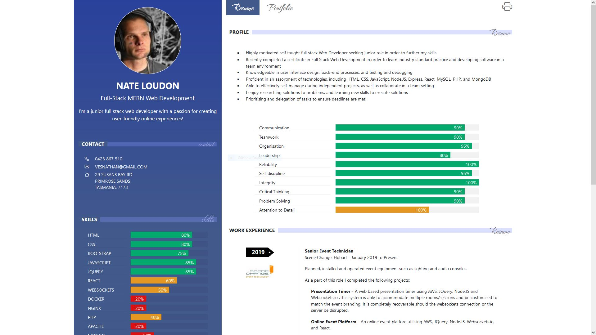
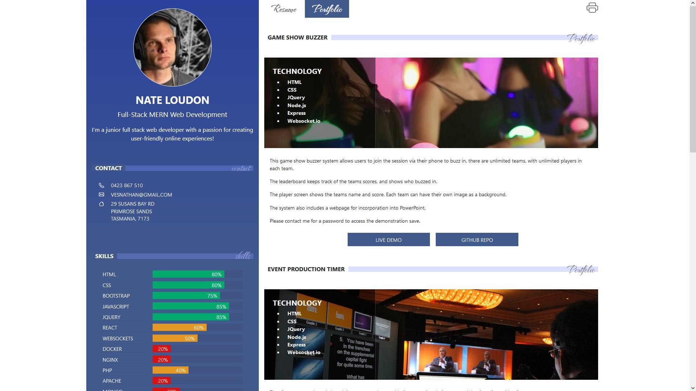

# My Portfolio and Resume

## CONTENTS

[1. DESCRIPTION](#DESCRIPTION)

[2. SCREENSHOTS](#SCREENSHOTS)

[3. INSTALLATION](#INSTALLATION)

[4. USAGE](#USAGE)

[5. CONTRIBUTE](#CONTRIBUTE)

[6. TESTS](#TESTS)

[7. LICENCE](#LICENCE)

[8. QUESTIONS](#QUESTIONS)

## DESCRIPTION

    This is my personal resume and portfolio page.

## SCREENSHOTS

## INSTALLATION

    For a new Ubuntu 20 AWS Lightsail Instance as of July 2022 

        sudo apt-get update  
        sudo mkdir -p /etc/apt/keyrings  
        curl -fsSL https://download.docker.com/linux/ubuntu/gpg | sudo gpg --dearmor -o /etc/apt/keyrings/docker.gpg  
        echo \  
        "deb [arch=$(dpkg --print-architecture) signed-by=/etc/apt/keyrings/docker.gpg] https://download.docker.com/linux/ubuntu \  
        $(lsb_release -cs) stable" | sudo tee /etc/apt/sources.list.d/docker.list > /dev/null  
        sudo apt-get update  
        sudo apt-get install docker-ce docker-ce-cli containerd.io docker-compose-plugin  

        Copy files to server, I don't think it really matters where... 
    
    

## USAGE

    from the folder with the files in, run  
    docker run -v $(pwd):/app -p 3000:3000 -d --name  portfolio portfolio-image  

## CONTRIBUTE

    No contributions accepted

## TESTS

    No tests created

## LICENCE
    
    Unlicenced
	

## QUESTIONS

    Please contact me at vesnathan@gmail.com for any questions.
[My GitHub Profile](https://github.com/vesnathan)

